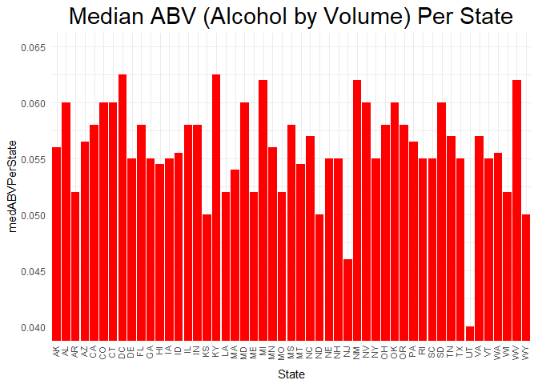
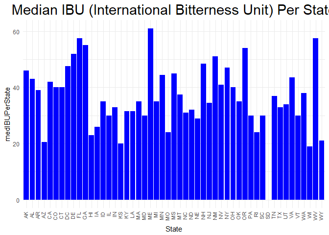
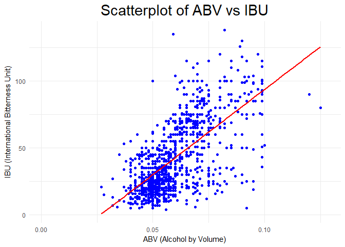

#Introduction             
This is a market analysis for the startup company Linsane Breweries. The company is interested in understanding the current geographic market for beer, and also the different styles by different breweries across the nation including District of Columbia.The main factors analyzed are alcohol by volume (ABV), international bitterness unit (IBU), and geography.The following report will show the ABV and IBU by state, and also high level plots of the relationship between ABV and IBU. 


#Data Cleaning Proccess              

This is the prelimnary cleaning of the beer names and ridding of duplicates of beers. The criteria for determining duplicates is if the beer name and ounces are the same. Also the cleaning of the beer names for special characters for ease of reading. Majority of incomplete beer names are renamed to help with ease of reading. The same process is done for the renaming of breweries. 


```r
setwd("C:/Users/sams/Desktop/SMU/January 2018/Doing Data Science/CaseStudy1")

raw_beers <- read.csv("Beers.csv", sep = ",")
colnames(raw_beers) <- c("Beer_Name", "Beer_id", "ABV", "IBU", "Brewery_id", "Style", "Ounces")
beers<-raw_beers[!duplicated(raw_beers[,c("Beer_Name","Ounces")]),]


breweries <- read.csv("Breweries.csv", sep = ",")
colnames(breweries) <- c("Brewery_id", "Brewery_Name", "City", "State")

mergedBeerData <- merge(beers, breweries, by = "Brewery_id", all.x = TRUE)

library(dplyr)
```

```
## 
## Attaching package: 'dplyr'
```

```
## The following objects are masked from 'package:stats':
## 
##     filter, lag
```

```
## The following objects are masked from 'package:base':
## 
##     intersect, setdiff, setequal, union
```

```r
mergedBeerData$Beer_Name <- gsub("är", "ar", mergedBeerData$Beer_Name)
mergedBeerData$Beer_Name <- gsub("ö", "o", mergedBeerData$Beer_Name)
mergedBeerData$Beer_Name <- gsub("’", "'", mergedBeerData$Beer_Name)
mergedBeerData$Beer_Name <- gsub("äu", "au", mergedBeerData$Beer_Name)
mergedBeerData$Beer_Name <- gsub("é", "l", mergedBeerData$Beer_Name)
mergedBeerData$Beer_Name <- gsub("è", "e", mergedBeerData$Beer_Name)
mergedBeerData$Beer_Name <- gsub("°", "°", mergedBeerData$Beer_Name)
mergedBeerData$Beer_Name <- gsub("â„¢", "", mergedBeerData$Beer_Name)
mergedBeerData$Beer_Name <- gsub("‘", "", mergedBeerData$Beer_Name)

mergedBeerData$Style <- gsub("är", "ar", mergedBeerData$Style)
mergedBeerData$Style <- gsub("ö", "o", mergedBeerData$Style)
mergedBeerData$Style <- gsub("’", "'", mergedBeerData$Style)
mergedBeerData$Style <- gsub("äu", "au", mergedBeerData$Style)
mergedBeerData$Style <- gsub("é", "l", mergedBeerData$Style)
mergedBeerData$Style <- gsub("è", "e", mergedBeerData$Style)
mergedBeerData$Style <- gsub("°", "°", mergedBeerData$Style)
mergedBeerData$Style <- gsub("â„¢", "", mergedBeerData$Style)
mergedBeerData$Style <- gsub("‘", "", mergedBeerData$Style)

mergedBeerData$Brewery_Name <- gsub("är", "ar", mergedBeerData$Brewery_Name)
mergedBeerData$Brewery_Name <- gsub("ö", "o", mergedBeerData$Brewery_Name)
mergedBeerData$Brewery_Name <- gsub("’", "'", mergedBeerData$Brewery_Name)
mergedBeerData$Brewery_Name <- gsub("äu", "au", mergedBeerData$Brewery_Name)
mergedBeerData$Brewery_Name <- gsub("é", "l", mergedBeerData$Brewery_Name)
mergedBeerData$Brewery_Name <- gsub("è", "e", mergedBeerData$Brewery_Name)
mergedBeerData$Brewery_Name <- gsub("°", "°", mergedBeerData$Brewery_Name)
mergedBeerData$Brewery_Name <- gsub("â„¢", "", mergedBeerData$Brewery_Name)
mergedBeerData$Brewery_Name <- gsub("‘", "", mergedBeerData$Brewery_Name)

mergedBeerData$City <- gsub("St Paul", "St. Paul", mergedBeerData$City)
mergedBeerData$Beer_Name <- gsub("Uncle Billy's Brewery and Smokeh...", "Uncle Billy's Brewery and Smokehouse", mergedBeerData$Beer_Name)
mergedBeerData$Beer_Name <- gsub("Red Shedman Farm Brewery and Hop...", "Red Shedman Farm Brewery and Hop Yard", mergedBeerData$Beer_Name)
mergedBeerData$Beer_Name <- gsub("Center of the Universe Brewing C...", "Center of the Universe Brewing Company", mergedBeerData$Beer_Name)
mergedBeerData$Beer_Name <- gsub("Southern Prohibition Brewing Com...", "Southern Prohibition Brewing Company", mergedBeerData$Beer_Name)
mergedBeerData$Beer_Name <- gsub("New Orleans Lager & Ale Brewing ...", "New Orleans Lager & Ale Brewing Company", mergedBeerData$Beer_Name)
mergedBeerData$Beer_Name <- gsub("(2012) (2012)", "(2012)", mergedBeerData$Beer_Name)

mergedBeerData$Brewery_Name <- gsub("Krebs Brewing Company \\(Pete's Pl...", "Krebs Brewing Company (Pete's Place)", mergedBeerData$Brewery_Name)
mergedBeerData$Brewery_Name <- gsub("Moat Mountain Smoke House & Brew...", "Moat Mountain Smoke House & Brewing Company", mergedBeerData$Brewery_Name)
mergedBeerData$Brewery_Name <- gsub("Oskar Blues Brewery \\(North Carol...", "Oskar Blues Brewery (North Carolina)", mergedBeerData$Brewery_Name)
mergedBeerData$Brewery_Name <- gsub("Jack's Hard Cider \\(Hauser Estate...", "Jack's Hard Cider Hauser Estate", mergedBeerData$Brewery_Name)
```

#1. How many breweries in each state?    
The number of breweries range from 1 to 47. Where there are many states, such as DC, South Dakota, and west Virginia, that one brewery and Colorado having 47 breweries.Below is the table of breweries by state.  


```r
table(breweries$State)
```

```
## 
##  AK  AL  AR  AZ  CA  CO  CT  DC  DE  FL  GA  HI  IA  ID  IL  IN  KS  KY 
##   7   3   2  11  39  47   8   1   2  15   7   4   5   5  18  22   3   4 
##  LA  MA  MD  ME  MI  MN  MO  MS  MT  NC  ND  NE  NH  NJ  NM  NV  NY  OH 
##   5  23   7   9  32  12   9   2   9  19   1   5   3   3   4   2  16  15 
##  OK  OR  PA  RI  SC  SD  TN  TX  UT  VA  VT  WA  WI  WV  WY 
##   6  29  25   5   4   1   3  28   4  16  10  23  20   1   4
```

#2. Merge beer data with the breweries data. Print the first 6 observations and the last six observations to check the merged file.                   
The merging code can be found in the section "Data Cleaning". The merge was done on beers.csv and breweries.csv based on Brewery_id. It was a one sided merge using beer.csv as the base. The following code is the check for the validity of the merge.


```r
head(mergedBeerData)
```

```
##   Brewery_id     Beer_Name Beer_id   ABV IBU
## 1          1  Get Together    2692 0.045  50
## 2          1 Maggie's Leap    2691 0.049  26
## 3          1    Wall's End    2690 0.048  19
## 4          1       Pumpion    2689 0.060  38
## 5          1    Stronghold    2688 0.060  25
## 6          1   Parapet ESB    2687 0.056  47
##                                 Style Ounces       Brewery_Name
## 1                        American IPA     16 NorthGate Brewing 
## 2                  Milk / Sweet Stout     16 NorthGate Brewing 
## 3                   English Brown Ale     16 NorthGate Brewing 
## 4                         Pumpkin Ale     16 NorthGate Brewing 
## 5                     American Porter     16 NorthGate Brewing 
## 6 Extra Special / Strong Bitter (ESB)     16 NorthGate Brewing 
##          City State
## 1 Minneapolis    MN
## 2 Minneapolis    MN
## 3 Minneapolis    MN
## 4 Minneapolis    MN
## 5 Minneapolis    MN
## 6 Minneapolis    MN
```

```r
tail(mergedBeerData)
```

```
##      Brewery_id                 Beer_Name Beer_id   ABV IBU
## 2349        556             Pilsner Ukiah      98 0.055  NA
## 2350        557  Heinnieweisse Weissebier      52 0.049  NA
## 2351        557           Snapperhead IPA      51 0.068  NA
## 2352        557         Moo Thunder Stout      50 0.049  NA
## 2353        557         Porkslap Pale Ale      49 0.043  NA
## 2354        558 Urban Wilderness Pale Ale      30 0.049  NA
##                        Style Ounces                  Brewery_Name
## 2349         German Pilsener     12         Ukiah Brewing Company
## 2350              Hefeweizen     12       Butternuts Beer and Ale
## 2351            American IPA     12       Butternuts Beer and Ale
## 2352      Milk / Sweet Stout     12       Butternuts Beer and Ale
## 2353 American Pale Ale (APA)     12       Butternuts Beer and Ale
## 2354        English Pale Ale     12 Sleeping Lady Brewing Company
##               City State
## 2349         Ukiah    CA
## 2350 Garrattsville    NY
## 2351 Garrattsville    NY
## 2352 Garrattsville    NY
## 2353 Garrattsville    NY
## 2354     Anchorage    AK
```

#3. Report the number of NA's in Each Column.            
This is also another check to see if there is any problems with the merge. Also it is to see whether there is any missing data. Fromm the analysis, we see that ABV has 61 missing and IBU has 991 missing for beers. The missing IBU can maybe explained because it can be a measure for hops in the beer, and that is proprietary data. The missing ABV is maybe breweries did not provide this data. 

```r
matrix_NA <- is.na(mergedBeerData)
class(matrix_NA)
```

```
## [1] "matrix"
```

```r
# The following line of code gives the number of NAs present in each column of the mergedBeerData
colSums(matrix_NA)
```

```
##   Brewery_id    Beer_Name      Beer_id          ABV          IBU 
##            0            0            0           61          991 
##        Style       Ounces Brewery_Name         City        State 
##            0            0            0            0            0
```

#4. Compute the median alcohol content and international bitterness unit for each state. Plot a bar chart to compare.          
When looking at the graphs for median ABV by state, we see that Utah comparatively has the lowest alcohol content at around 0.04 or 4%. DC has the highest alcohol content at 0.0625 or 6.25%. When looking at the graphs for IBU, South Dakota did not record any IBU values so there is no information on this state. The lowest IBU content is 17 for the state Wisconsin and the highest IBU is 61 for the state Maine. We have to keep in mind the range of IBU is from 0 to 100, where 100 is the most bitter.  

```r
medianabv<-mergedBeerData %>% 
     group_by(State) %>% 
     summarize(medABVPerState = median(ABV, na.rm = TRUE))
medianIBU<-mergedBeerData %>% 
     group_by(State) %>% 
     summarize(medIBUPerState = median(IBU, na.rm = TRUE))
mergedmedians <- merge(medianabv,medianIBU,by="State",all=TRUE)
mergedmedians
```

```
##    State medABVPerState medIBUPerState
## 1     AK         0.0560           46.0
## 2     AL         0.0600           43.0
## 3     AR         0.0520           39.0
## 4     AZ         0.0565           20.5
## 5     CA         0.0580           42.0
## 6     CO         0.0600           40.0
## 7     CT         0.0600           40.0
## 8     DC         0.0625           47.5
## 9     DE         0.0550           52.0
## 10    FL         0.0580           57.5
## 11    GA         0.0550           55.0
## 12    HI         0.0545           23.0
## 13    IA         0.0550           26.0
## 14    ID         0.0555           35.0
## 15    IL         0.0580           30.0
## 16    IN         0.0580           33.0
## 17    KS         0.0500           20.0
## 18    KY         0.0625           31.5
## 19    LA         0.0520           31.5
## 20    MA         0.0540           35.0
## 21    MD         0.0600           30.0
## 22    ME         0.0520           61.0
## 23    MI         0.0620           35.0
## 24    MN         0.0560           44.5
## 25    MO         0.0520           24.0
## 26    MS         0.0580           45.0
## 27    MT         0.0545           37.5
## 28    NC         0.0570           31.0
## 29    ND         0.0500           32.0
## 30    NE         0.0550           29.0
## 31    NH         0.0550           48.5
## 32    NJ         0.0460           34.5
## 33    NM         0.0620           51.0
## 34    NV         0.0600           41.0
## 35    NY         0.0550           47.0
## 36    OH         0.0580           40.0
## 37    OK         0.0600           35.0
## 38    OR         0.0580           54.0
## 39    PA         0.0565           30.0
## 40    RI         0.0550           24.0
## 41    SC         0.0550           30.0
## 42    SD         0.0600             NA
## 43    TN         0.0570           37.0
## 44    TX         0.0550           33.0
## 45    UT         0.0400           34.0
## 46    VA         0.0570           43.5
## 47    VT         0.0550           30.0
## 48    WA         0.0555           38.0
## 49    WI         0.0520           19.0
## 50    WV         0.0620           57.5
## 51    WY         0.0500           21.0
```

```r
library(ggplot2)

ggplot(mergedmedians,aes(State,medABVPerState))+
geom_bar(stat="identity",fill="red")+
theme_minimal()+ggtitle("Median ABV (Alcohol by Volume) Per State")+theme(plot.title = element_text(hjust = 0.5,size=22), axis.text.x=element_text(angle=90,hjust=0.95,vjust=0.2,size=8))+coord_cartesian(ylim = c(0.04,0.065))
```

<!-- -->

```r
ggplot(mergedmedians,aes(State,medIBUPerState))+
    geom_bar(stat="identity",fill="blue")+
theme_minimal()+ggtitle("Median IBU (International Bitterness Unit) Per State")+theme(plot.title = element_text(hjust = 0.5,size=22),axis.text.x=element_text(angle=90,hjust=0.95,vjust=0.2,size=8))
```

```
## Warning: Removed 1 rows containing missing values (position_stack).
```

<!-- -->

#5. Which state has the maximum alcoholic (ABV) beer? Which state has the most bitter (IBU) beer?            
The analysis is done based on median values calculated by State. This is more of central tendency measurement, so it would not be influenced by outliers. When looking at the graphs for median ABV by state, we see that DC has the highest alcohol content at 0.0625 or 6.25%. When looking at the graphs for IBU, the highest IBU is 61 for the state Maine. We have to keep in mind the range of IBU is from 0 to 100,

```r
maxABVstate<-mergedmedians[which.max(mergedmedians$medABVPerState),]
maxABVstate
```

```
##   State medABVPerState medIBUPerState
## 8    DC         0.0625           47.5
```

```r
maxIBUstate<-mergedmedians[which.max(mergedmedians$medIBUPerState),]
maxIBUstate
```

```
##    State medABVPerState medIBUPerState
## 22    ME          0.052             61
```

#6. Summary statistics for the ABV variable.            
When looking at all ABV for beers, we calculated the 5 number summary. The minimum is 0.001 or 0.01% and the maximum is 0.128 or 12.8%. Giving a range of 12.7%.For 25% of the data, the range of ABV is betewen 0.01% to 5%. For 50% of the data, the range of ABV is 0.01% to 5.6%. For 75% of the data, the range of ABV is between 0.01% to 6.8%. The average ABV content is 5.98%.   

```r
summary(mergedBeerData$ABV)
```

```
##    Min. 1st Qu.  Median    Mean 3rd Qu.    Max.    NA's 
## 0.00100 0.05000 0.05600 0.05989 0.06800 0.12800      61
```

#7. Is there an apparent relationship between the bitterness of the beer and its alcoholic content? Draw a scatter plot.You are welcome to use the ggplot2 library for graphs. Please ignore missing values in your analysis. Make your best judgment of a relationship and EXPLAIN your answer.  

When looking at the scatterplot of ABV vs. IBU, we see that the points are clustered more in a linear upward trend. This may signify a postive linear correlation between ABV annd IBU. A Pearson correlation test is done to see if there is a statistical significant relationship. The pvalue for the test is <0.0001. Therefore, we may be able to say that about 43% of the variation is IBU is explained by ABV where the correlation between the two variable is 0.66. 


```r
ggplot(mergedBeerData, aes(ABV, IBU)) +geom_point(color="blue") +
     theme_minimal()+ggtitle("Scatterplot of ABV vs IBU")+ theme(plot.title = element_text(hjust = 0.5,size=22))+labs(x="ABV (Alcohol by Volume)",y="IBU (International Bitterness Unit)")+  geom_smooth(method=lm, se=FALSE, color="red")
```

```
## Warning: Removed 991 rows containing non-finite values (stat_smooth).
```

```
## Warning: Removed 991 rows containing missing values (geom_point).
```

<!-- -->

```r
cor.test(mergedBeerData$ABV,mergedBeerData$IBU)
```

```
## 
## 	Pearson's product-moment correlation
## 
## data:  mergedBeerData$ABV and mergedBeerData$IBU
## t = 33.114, df = 1361, p-value < 2.2e-16
## alternative hypothesis: true correlation is not equal to 0
## 95 percent confidence interval:
##  0.6374899 0.6963749
## sample estimates:
##       cor 
## 0.6679766
```

#Conclusion            
After analyzing the data, we see that there is high number of breweries that are located in Colorado and California area. The reason behind this we do not know, however it is possible the water quality maybe better there or a high concentration of people that love beer in that area. When looking at the overall alcohol content, the range is between 5.6% to 6.8% being near to the middle 50% of beers analyzed. Also the mean and median are close (5.9% and 5.6% respectively).The measure for IBU for this data may not be reliable just because it is proprietary. From the beers that do provide this data, we see that the range of bitterness is between 17 and 61. When looking at the scatterplot and the statistical analysis for linear correlation, we some evidence that IBU and ABV having a positive linear relationship.The bitterness of beer may come from the amount of alcohol or visa versa.
For further analysis, we can analyze which style of beers, and also the profile (ABV and IBU) that are popular amongst customers. Further analysis should be on where to locate breweries to maximize profit. 


